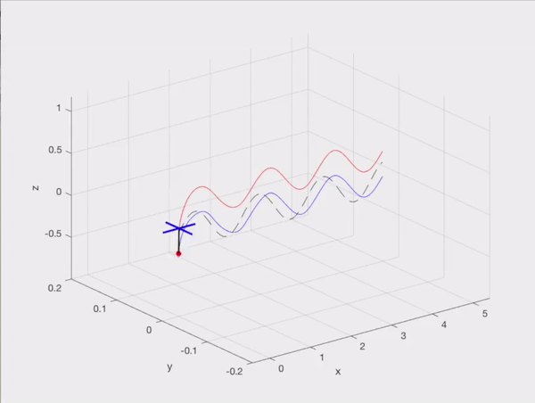
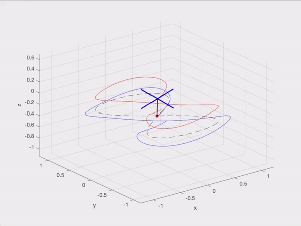

# Modelling and Control of a Quadrotor with Cable Suspended Load

The code is an implementation of a paper that considers the modeling and control of a quadrotor with a cable suspended load. The system is modeled using the Newton-Euler approach and its dynamics are split into cable taut and nontaut dynamics with a continuous switching case between the two. The differential flatness properties of the quadrotor-load system are then used to derive a nonlinear cascaded control pipeline with errors operating on R^3, S^2, and SO(3) configuration spaces. The load position and attitude, and the quadrotor attitude controllers are designed to be a proportional derivative controller with feedforward terms from the inverted dynamics. The system was discretized and implemented in simulation where it was tested with three load trajectories: a step input, a sinusoid and ramp in x-z, and a 2D lemniscate in x-y. The original PD controller proposed in the literature suffered from a steady-state error, which this paper solved by introducing an integral term in the form of a PID controller.

## Installation

Install the files into an environment containing MATLAB

## Usage

In main.m:
- Change any needed quadrotor-load parameters
- Change simulation parameters (timestep, total time, controller frequencies, control gains, etc.) as needed
- Run main.m

## References

_Sreenath, Koushil, Taeyoung Lee, and Vijay Kumar. "Geometric control and differential flatness of a quadrotor UAV with a cable-suspended load." 52nd IEEE Conference on Decision and Control. IEEE, 2013._
